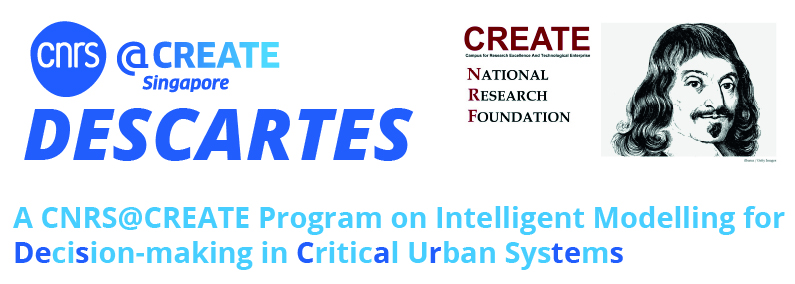
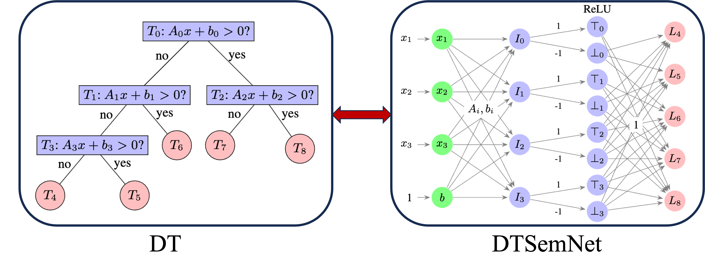

DTSemNet 
========

Welcome to the official implementation of the DTSemNet architecture, as proposed in the paper:
“Vanilla Gradient Descent for Oblique Decision Trees,” ECAI-2024.
[[Paper]](https://arxiv.org/pdf/2408.09135) [[Website]](https://cps-research-group.github.io/dtsemnet)



## Overview
DTSemNet is a novel invertible encoding of Oblique Decision Trees (ODT) as a Neural Network (NN) facilitating the training of ODT using vanilla gradient descent. This repository contains all the necessary files and scripts to replicate the experiments and results presented in the paper. We have reused some parts of code from [CRO-DT](https://github.com/vgarciasc/CRO-DT), [DGT](https://github.com/microsoft/DGT) and [ICCT](https://github.com/vgarciasc/CRO-DT).

## Repository Structure
- src/dtsemnet.py: Core implementation of the DTSemNet model.
- src/net_train.py: Script for training on small classification datasets.
- src/net_train2.py: Script for training on large classification datasets, with GPU support.
- src/reg_train_linear.py: Script for training DTSemNet on regression tasks.
- /results: Directory where training logs are saved. Previous logs used in our paper are available in /results/ecai-reported.
- /results/combined_mean.py: In the case of multiple splits, the reported mean ± standard deviation are calculated by combining the results from each split.


## Datasets

### Classification (Small)
Included in the `datasets' directory: [breast_cancer,car,banknote,balance,acute−1,acute−2,transfusion,climate,sonar,optical,drybean,avila,wine−red,wine−white]

**Due to size constraints, the following datasets are included. It needs to be downloaded to `datasets' directory.**

### Classification (Large)
| Dataset Name   | Download Link |
|----------------|---------------|
| mnist          | PyTorch Auto-Download |
| letter         | [Download](https://www.csie.ntu.edu.tw/~cjlin/libsvmtools/datasets/multiclass/letter.scale) |
| connect        | [Download](https://www.csie.ntu.edu.tw/~cjlin/libsvmtools/datasets/multiclass/connect-4) |
| segment        | [Download](https://www.csie.ntu.edu.tw/~cjlin/libsvmtools/datasets/multiclass/segment.scale) |
| satimages      | [Download](https://www.csie.ntu.edu.tw/~cjlin/libsvmtools/datasets/multiclass/satimage.scale) |
| pendigits      | [Download](https://www.csie.ntu.edu.tw/~cjlin/libsvmtools/datasets/multiclass/pendigits) |
| protein        | [Download](https://www.csie.ntu.edu.tw/~cjlin/libsvmtools/datasets/multiclass/protein.bz2) |
| sensit         | [Download](https://www.csie.ntu.edu.tw/~cjlin/libsvmtools/datasets/multiclass/vehicle/combined.bz2) |

### Regression
| Dataset Name   | Download Link |
|----------------|---------------|
| abalone        | [Download](https://github.com/microsoft/DGT/tree/main/datasets/abalone) |
| ailerons       | [Download](https://www.dcc.fc.up.pt/~ltorgo/Regression/DataSets.html) |
| cpu_active     | [Download](https://www.cs.toronto.edu/~delve/data/comp-activ/desc.html) |
| pdb_bind       | [Download](http://www.pdbbind.org.cn/) |
| year           | [Download](https://archive.ics.uci.edu/ml/datasets/YearPredictionMSD) |
| ctslice        | [Download](https://archive.ics.uci.edu/dataset/206/relative+location+of+ct+slices+on+axial+axis) |
| ms             | [Download](https://www.microsoft.com/en-us/research/project/mslr/) |


## Installation
Please install conda environment using `environment.yml`. In case, there is an error in PyTorch installation, please install the same version manually. 
```bash
conda env create -f environment.yml
conda activate dtsemnet
```

Also, install the packages in `src' directory:
```bash
python -m pip install -e .
```


## Execute Code for Classification Dataset with **Small DTs**
```bash
python -m src.net_train --model dtsemnet --dataset all --depth 4 -s 1 --output_prefix dtsement --verbose True
```

    - replace `dtsemnet` with `dgt` for DGT evaluation
    - For time computation restrict number of cores to 8, use `taskset -cpa 0-7`
    - s: Number of simulations for averaging (100 for small DTs and 10 for large DTs)
    - depth: Height of the DT
    - dataset: Use appropriate dataset name. `all' to evaluate all datasets
    - output_prefix: helps in managing the name of the log file

## Execute Code for Classification Dataset with **Large DTs**
```bash
python -m src.net_train2 --model dtsemnet --dataset mnist -s 1 --output_prefix dtsement --verbose True -g
```
    - Height is included in the configuration file, there is no need to specify
    - model: `dtsemnet' or `dgt'
    - dataset: use appropriate name of the dataset
    - add `-g` for GPU operation

## DTSemNet-Regression
Use the following terminal command for regression datasets ["abalone", "ailerons", "cpu_active", "pdb_bind", "year", "ctslice", "ms"].

```bash
python -m src.reg_train_linear --model dtregnet --dataset ailerons -s 1 --output_prefix ailerons --verbose True -g
```

    - Use `--model dtregnet` for for DTSemNet-regression


##

If you find DTSemNet useful in your research, please cite our work:

> **Subrat Panda, Blaise Genest, Arvind Easwaran, and Ponnuthurai Suganthan**, *"Vanilla Gradient Descent for Oblique Decision Trees,"* European Conference on Artificial Intelligence (ECAI), 2024. [Link to paper](https://arxiv.org/pdf/2408.09135)


